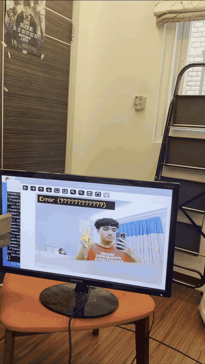
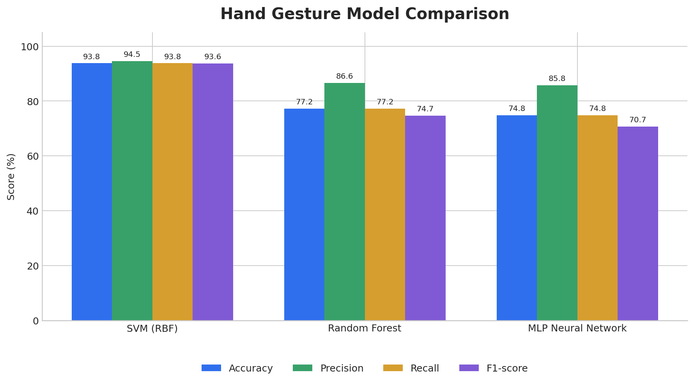
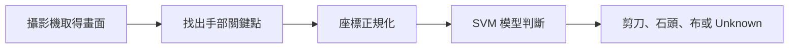

[README.md](https://github.com/user-attachments/files/32142233/README.md)
# 樹莓派即時手勢辨識

這是一個使用 Raspberry Pi 和攝影機完成的剪刀、石頭、布辨識系統。攝影機拍到手勢後，程式會先找出手部的 21 個關鍵點，再交給訓練好的模型判斷目前的手勢。

在這次專題中，我們也比較了 SVM、隨機森林和 MLP 神經網路三種模型，最後選擇準確率最高的 SVM 放到 Raspberry Pi 上進行即時辨識。



## 專題內容

原本的做法是將 64 × 64 的灰階圖片直接轉成 4,096 個像素數值進行訓練，但這種方式容易受到背景和光線影響。

後來我們改用 MediaPipe 找出手部的 21 個關鍵點，每個點包含 x、y、z 三個座標，因此每張圖片會轉換成 63 個特徵。接著再用手腕當作基準點，並依照手掌大小進行正規化，減少手在畫面中的位置和距離對辨識結果的影響。

這次主要完成的內容有：

- 使用 MediaPipe 擷取手部 21 個關鍵點
- 比較 SVM、隨機森林和 MLP 神經網路三種模型
- 將原本 4,096 維的像素資料減少為 63 維的手部座標
- 加入位置與大小的正規化處理
- 將最佳模型放到 Raspberry Pi 上進行即時辨識
- 當模型信心度低於 70% 時，顯示為 `Unknown`，避免隨便判斷成剪刀、石頭或布

## 模型比較結果



| 模型 | 準確率 | 精確率 | 召回率 | F1 分數 |
| --- | ---: | ---: | ---: | ---: |
| **SVM（RBF）** | **93.77%** | **94.50%** | **93.77%** | **93.64%** |
| 隨機森林 | 77.24% | 86.56% | 77.24% | 74.68% |
| MLP 神經網路 | 74.80% | 85.75% | 74.80% | 70.73% |

三種模型都是使用同一份測試資料進行比較，測試資料共有 369 筆。從結果可以看到 SVM 的整體表現最好，因此最後選擇 SVM 作為即時辨識使用的模型。

加入手部座標正規化後，SVM 的準確率也從原本的 88.1% 提升到 93.8%，代表資料的處理方式會直接影響模型的辨識效果。

更完整的結果說明可以查看 [模型分析](raspberry-pi-hand-gesture-recognition/docs/model_analysis.md)。

## 系統流程



## 資料夾內容

```text
.
├── assets/                  # 展示 GIF 和模型比較圖
├── docs/                    # 模型分析說明
├── models/
│   └── best_landmark_model.pkl
├── results/
│   └── model_comparison.csv
├── scripts/
│   └── plot_results.py
├── src/
│   ├── download_hand_landmarker.py
│   ├── extract_dataset.py
│   ├── features.py
│   ├── realtime_demo.py
│   └── train_models.py
├── .gitignore
├── requirements-dev.txt
└── requirements.txt
```

## 安裝方式

建議使用 Python 3.9～3.11。

```bash
python -m venv .venv
source .venv/bin/activate
pip install -r requirements.txt
python src/download_hand_landmarker.py
```

如果使用 Windows，虛擬環境啟動指令要改成：

```bash
.venv\Scripts\activate
```

## 執行即時辨識

連接攝影機後執行：

```bash
python src/realtime_demo.py
```

如果要更改攝影機編號或信心度，可以使用：

```bash
python src/realtime_demo.py --camera 0 --threshold 0.70
```

按下 `q` 可以關閉程式。

## 重新訓練模型

由於圖片數量較多，因此資料集沒有一起放到 GitHub。若要重新訓練，需要先準備以下資料夾：

```text
dataset/
├── train/
│   ├── rock/
│   ├── paper/
│   └── scissors/
└── test/
    ├── rock/
    ├── paper/
    └── scissors/
```

接著依序執行：

```bash
python src/download_hand_landmarker.py
python src/extract_dataset.py --dataset dataset
python src/train_models.py --features results/landmark_features.joblib
```

程式會依序訓練三種模型、輸出比較結果，並將準確率最高的模型存成 `models/best_landmark_model.pkl`。

## 實作心得

這次專題讓我了解到，模型並不是越複雜就一定越準確。雖然 MLP 是神經網路模型，但在這份資料上反而是 SVM 的效果最好。另外，將原始圖片改成手部關鍵點後，不只減少了資料量，也降低了背景對辨識的影響。

實際放到 Raspberry Pi 上測試後，也發現測試資料的準確率不代表現場一定會得到完全相同的結果，因為光線、背景、手勢角度和攝影機距離都可能造成影響。透過這次實作，我完成了從資料處理、模型訓練與比較，到 Raspberry Pi 即時辨識的完整流程。
