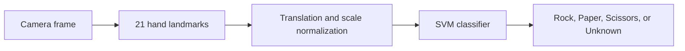

# Raspberry Pi Real-Time Hand Gesture Recognition

A lightweight rock-paper-scissors classifier that compares multiple machine-learning models and deploys the best model for real-time inference on Raspberry Pi.


## Project highlights

- Replaced a 4,096-dimensional raw-pixel baseline with 63 MediaPipe hand-landmark features.
- Added translation and scale normalization to reduce sensitivity to hand position and camera distance.
- Compared SVM, Random Forest, and MLP models on the same held-out test set.
- Selected a compact SVM model for real-time edge deployment.
- Added a 0.70 confidence threshold so uncertain or unsupported gestures are reported as `Unknown` instead of being forced into one of the three classes.

## Model comparison


| Model | Accuracy | Precision | Recall | F1-score |
| --- | ---: | ---: | ---: | ---: |
| **SVM (RBF)** | **93.77%** | **94.50%** | **93.77%** | **93.64%** |
| Random Forest | 77.24% | 86.56% | 77.24% | 74.68% |
| MLP Neural Network | 74.80% | 85.75% | 74.80% | 70.73% |

The results were measured on the original held-out test set of 369 images. The selected SVM uses an RBF kernel, `C=10`, and probability estimates. Full observations are documented in [docs/model_analysis.md](docs/model_analysis.md).

## System workflow



## Repository structure

```text
.
├── assets/                  # Demo and result visualization
├── docs/                    # Model analysis and design notes
├── models/
│   └── best_landmark_model.pkl
├── results/
│   └── model_comparison.csv
├── scripts/
│   └── plot_results.py
├── src/
│   ├── download_hand_landmarker.py
│   ├── extract_dataset.py
│   ├── features.py
│   ├── realtime_demo.py
│   └── train_models.py
├── .gitignore
├── requirements-dev.txt
└── requirements.txt
```

## Setup

Python 3.9–3.11 is recommended because MediaPipe support can vary by platform.

```bash
python -m venv .venv
source .venv/bin/activate
pip install -r requirements.txt
python src/download_hand_landmarker.py
```

On Windows, activate the environment with `.venv\Scripts\activate`.

## Run the Raspberry Pi demo

Connect a camera, then run:

```bash
python src/realtime_demo.py
```

Useful options:

```bash
python src/realtime_demo.py --camera 0 --threshold 0.70
```

Press `q` to close the window.

## Reproduce training

The image dataset is not included because of repository size and redistribution constraints. Prepare it in this structure:

```text
dataset/
├── train/
│   ├── rock/
│   ├── paper/
│   └── scissors/
└── test/
    ├── rock/
    ├── paper/
    └── scissors/
```

Then run:

```bash
python src/download_hand_landmarker.py
python src/extract_dataset.py --dataset dataset
python src/train_models.py --features results/landmark_features.joblib
```

The training script evaluates all three models, writes the metrics to `results/model_comparison.csv`, and saves the highest-accuracy model to `models/best_landmark_model.pkl`.

## Technical takeaway

The strongest improvement came from feature engineering rather than simply increasing model complexity. Converting images into normalized hand landmarks reduced the input from 4,096 pixel values to 63 geometric features and improved the SVM result from 88.1% to 93.8%. The deployment also showed that offline accuracy is not the only concern: lighting, pose angle, background, confidence calibration, and the Raspberry Pi's limited resources all affect real-world behavior.
